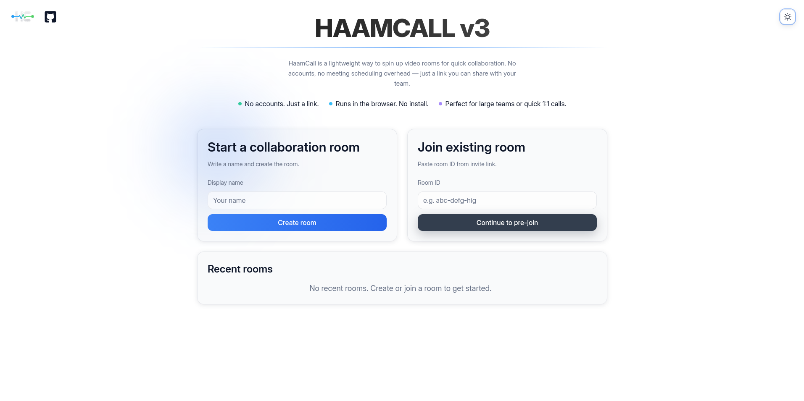
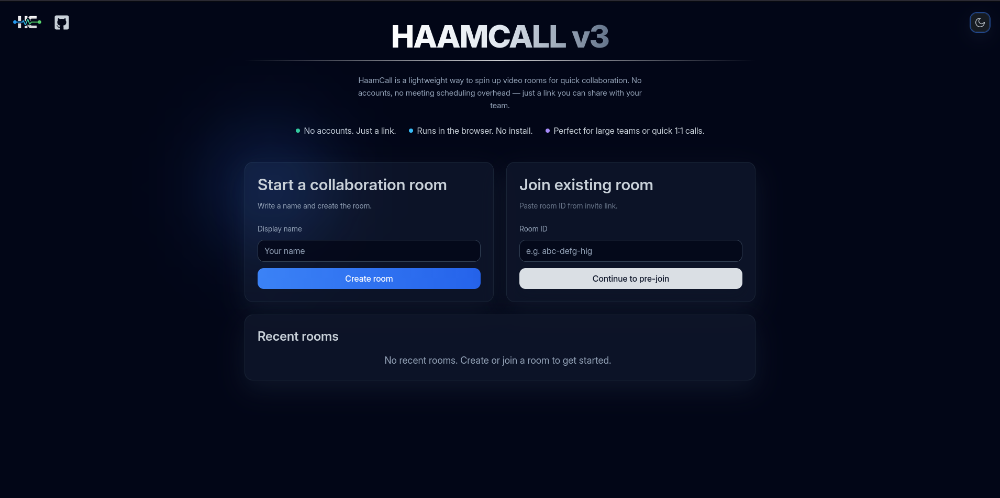

    

<h3 align="center">HaamCall v3</h3>
<h5 align="center">HaamCall v3 is a lightweight browser-based meeting app for fast team collaboration.</h5>

Language :  [English](README.md) | [فارسی](README-fa.md)

---

## Table of Contents

- [Architecture](#architecture)
- [What Kind of Meetings You Can Have](#what-kind-of-meetings)
- [Key Features](#key-features)
- [Usage](#usage)
- [Project Evolution](#project-evolution)
- [Security](#security)
- [Tech Stack](#tech-stack)

## 🏗️ Architecture

HaamCall uses a **real-time SFU architecture** to keep meetings smooth as participants grow:

- Web app for meeting experience
- Backend service for room/session management
- LiveKit SFU for real-time audio/video/screen share transport

### 📈 Impact on Meeting Quality

- **SFU-based media routing (LiveKit)** improves quality for group calls by avoiding full mesh peer-to-peer overhead.
- **Adaptive video grid + active speaker highlighting** keeps focus clear in larger rooms.
- **Reconnection handling + connection banners** improves reliability under unstable networks.
- **TURN support** helps participants behind strict NAT/firewalls join more successfully.
- **State isolation with Zustand stores** keeps room UI responsive and predictable during rapid media events.

## 👥 What Kind of Meetings You Can Have

- **1:1 quick calls** for instant check-ins.
- **Small team standups** with camera/mic and chat.
- **Larger collaboration rooms** with adaptive participant layout.
- **Presentation-style sessions** with screen sharing.
- **Async-friendly sessions** using file upload/download and in-room chat.

## ✨ Key Features

- Instant room creation + join by link
- No account required for regular meetings
- Pre-join camera/mic readiness check
- In-room controls: mic, camera, screen share, leave
- Real-time chat and participant list
- File sharing inside meeting rooms
- Responsive UI for desktop and mobile

## 🚀 Usage

Using HaamCall is designed to be simple and fast.

### 🆕 Creating a Meeting Room

1. Open the HaamCall landing page.
2. Click **Create Room**.
3. Allow camera and microphone access if prompted.
4. Share the generated room link with other participants.
5. Participants can join instantly using the link — no account required.

### 🔗 Joining a Meeting

1. Open the shared room link.
2. Complete the **pre‑join camera and microphone check**.
3. Click **Join Meeting** to enter the room.

### 📱 Installing as a PWA

HaamCall can be installed as a **Progressive Web App (PWA)** for a more native experience.

Steps:

1. Open HaamCall in a supported browser (Chrome, Edge, etc.).
2. Click the **Install** button in the browser address bar.
3. Launch HaamCall directly from your desktop or app launcher.

The PWA version provides:

- Faster startup
- Standalone window mode
- Better meeting workflow without browser UI distractions

## 🔄 Project Evolution

HaamCall has evolved through several major iterations as the architecture and feature set improved.

| Version | Key Changes                                                                                                                                                                                  |
| ------- | -------------------------------------------------------------------------------------------------------------------------------------------------------------------------------------------- |
| **v1**  | Initial prototype for browser-based meetings.                                                                                                                                                |
| **v2**  | Switched to **WebRTC peer-to-peer (P2P)** connections using vanilla JavaScript. Added **file sharing inside meeting rooms**.                                                                 |
| **v3**  | Migrated from **P2P to SFU architecture using LiveKit** for better scalability. Rebuilt the **entire UI using React + Vite + Tailwind** and introduced **Light Theme alongside Dark Theme**. |

<h3 align="center">☀️ Light Mode</h3>

  

<h3 align="center">🌙 Dark Mode</h3>

  

### ⚙️ Why the SFU Migration Matters

Moving from **peer-to-peer (mesh)** to **SFU** significantly improves performance in group meetings.

In P2P:

- Each participant sends media to every other participant.
- Bandwidth usage grows quickly as the room size increases.

With **SFU (LiveKit)**:

- Each participant sends a single media stream to the server.
- The server forwards optimized streams to participants.

This allows **larger rooms, more stable connections, and better overall call quality.**

## 🔐 Security

- Server-side room and session management (no direct client trust)
- Admin panel protected with credential login and expiring sessions
- TURN support for secure/reliable connectivity across restrictive networks
- Token-based room access issued by the backend before joining media sessions
- Input validation and error boundaries for safer request/UI handling

## 🧰 Tech Stack

- **Frontend:** React, TypeScript, Vite, Tailwind CSS, Zustand
- **Backend:** NestJS, TypeScript
- **Real-time media:** LiveKit (SFU), WebRTC, TURN (coturn)
- **Infrastructure:** Docker, Docker Compose
